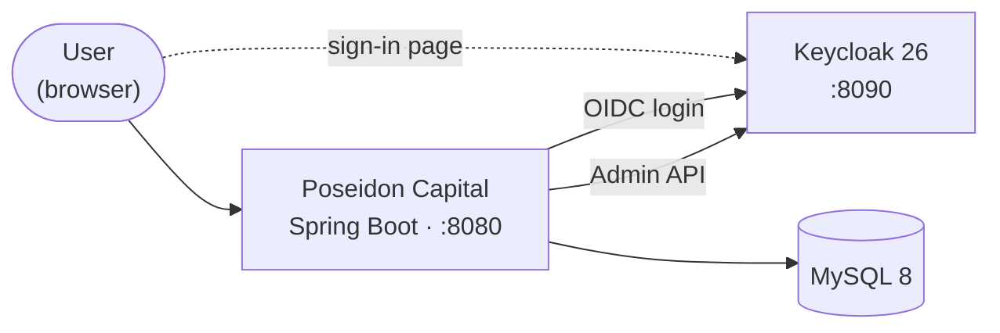

# ⚓ Poseidon Capital

> A Spring Boot web application for a financial firm: five kinds of financial records, created and edited through a Thymeleaf interface. The OpenClassrooms starting point was a skeleton of empty classes and TODO comments, with a brief covering the controller layer, the views and a basic authentication. **That last part was pushed well beyond the brief**: authentication and the entire user lifecycle are delegated to Keycloak, which owns the login page, the credentials and the roles.


---

## Contents

- [Architecture](#️-architecture)
- [Tech stack](#️-tech-stack)
- [Authentication and authorization](#-authentication-and-authorization)
- [User lifecycle across two systems](#-user-lifecycle-across-two-systems)
- [Validation and error handling](#-validation-and-error-handling)
- [Tests](#-tests)

---

## 🏗️ Architecture



The application talks to Keycloak in **two distinct ways**, and that split is the core of the design:

- as an **OIDC client**, to authenticate users - the browser is redirected to Keycloak, which owns the login screen and the credentials;
- as an **admin client**, through the Keycloak Admin REST API, to create, update and delete accounts from the application's own user-management screens.

MySQL stores the business records and the user *profiles* - never a password.

---

## 🛠️ Tech stack

| Area | Technologies |
|---|---|
| **Language** | Java 17 |
| **Framework** | Spring Boot 3.1.0 (Web, Data JPA, Validation, Thymeleaf) |
| **Identity provider** | Keycloak 26.0.7 |
| **Security** | Spring Security · OAuth2 Client (OIDC) · `keycloak-admin-client` |
| **View** | Thymeleaf · Bootstrap (bundled locally) |
| **Database** | MySQL 8 |
| **Build** | Maven (wrapper included - no global install needed) |
| **Other** | Lombok · JUnit 5 · Mockito · AOP logging aspect |

---

## 🔐 Authentication and authorization

**The login page is served by Keycloak, not by the application.** Any unauthenticated request is redirected to the identity provider, which checks the credentials and returns an ID token - the application never sees a password during sign-in.

**Mapping Keycloak roles to Spring Security.** Keycloak exposes realm roles inside a `realm_access` claim, a structure Spring Security does not read on its own: without a translation step, `hasRole("ADMIN")` matches nothing and every protected route ends in a 403. A custom `OidcUserService` therefore extracts the roles from that claim and turns them into `ROLE_*` authorities before the security context is built.

| Path | Access |
|---|---|
| `/home`, `/login` | public |
| `/user/**` | `ADMIN` only |
| everything else | authenticated |

**Logout is RP-initiated.** `OidcClientInitiatedLogoutSuccessHandler` propagates the logout to Keycloak so the identity provider session ends too, not just the local one - otherwise a user who signs out is silently signed back in on the next request, since the Keycloak session is still valid. The local session is invalidated, the authentication cleared and the `JSESSIONID` cookie removed.

---

## 👥 User lifecycle across two systems

An account lives in two places at once: **Keycloak** owns the credentials and the roles, **MySQL** owns the profile. The `User` entity links the two through a unique `keycloak_id` column, and its password field is annotated **`@Transient`** - it travels from the form to Keycloak and is never persisted locally.

Because an HTTP call to Keycloak cannot take part in a SQL transaction, the two writes can diverge. Each operation therefore orders them deliberately:

| Operation | Order | On failure |
|---|---|---|
| **Create** | Keycloak first, then the database | The Keycloak account just created is **deleted** - a compensating action, since no transaction can cover both systems |
| **Update** | Keycloak (password, role), then the database | The profile update is rolled back by the surrounding transaction |
| **Delete** | Database first, then Keycloak | Under `@Transactional`: if Keycloak deletion fails, the database deletion is rolled back |

Two failures coming back from Keycloak are surfaced to the user rather than swallowed: a **duplicate username** (`409 CONFLICT`) and a **password rejected by the realm policy** both appear as an error message on the relevant form field.

---

## ✅ Validation and error handling

Every form is validated **server-side** with Bean Validation (`@Valid` + `BindingResult`). On failure the controller re-renders the form and Thymeleaf displays the message next to the offending field, with the submitted values preserved. Text fields are length-bounded, integer fields constrained to a range, and decimal fields rejected when they are not numeric - each constraint carrying its own message rather than a default framework string.

User accounts are stricter: a password needs at least 8 characters with an uppercase letter, a digit and a special character. That rule is enforced by the application **and** by the Keycloak realm policy, so a rejection from either side comes back on the field.

Beyond form input, the service layer throws `IllegalArgumentException` when a record does not exist; a `@ControllerAdvice` catches it and renders a styled *Resource Not Found* page carrying the message, and a user without the required role gets a dedicated 403 page instead of a stack trace.

A Spring AOP aspect also wraps every method in the application, logging the **layer** it belongs to (`CONTROLLER`, `SERVICE`, `REPOSITORY`), the class and method, and on exit the **elapsed time in milliseconds** - a readable trace across the layers, with no logging statement inside the business code.

---

## 🧪 Tests

```bash
./mvnw test
```

The service layer is covered by unit tests written with **JUnit 5 and Mockito**, repositories mocked. Each service is tested on both paths: the **nominal** cases - values correctly set on creation, applied on update, entity returned on lookup - and the **failure** cases, where a missing identifier raises `IllegalArgumentException` and the test asserts that **no write ever reaches the repository**.
